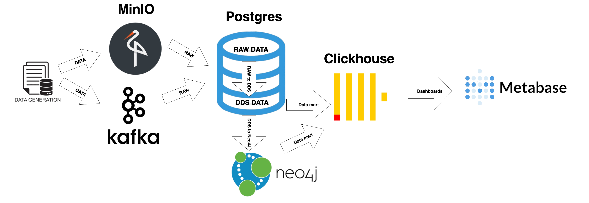
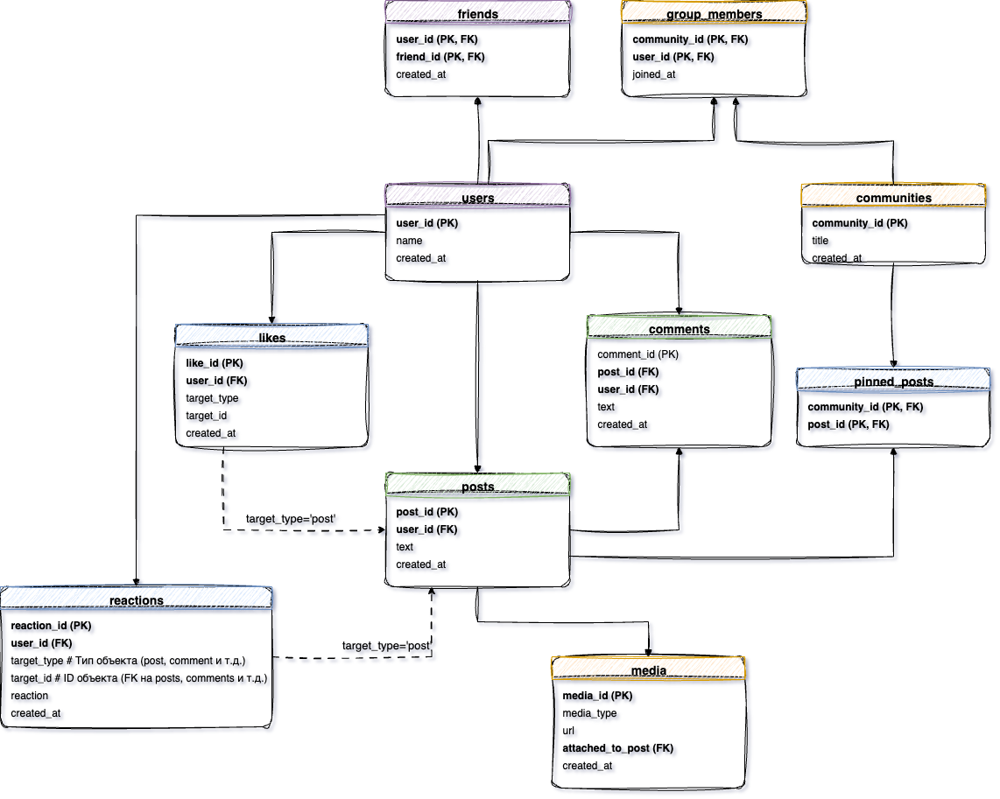
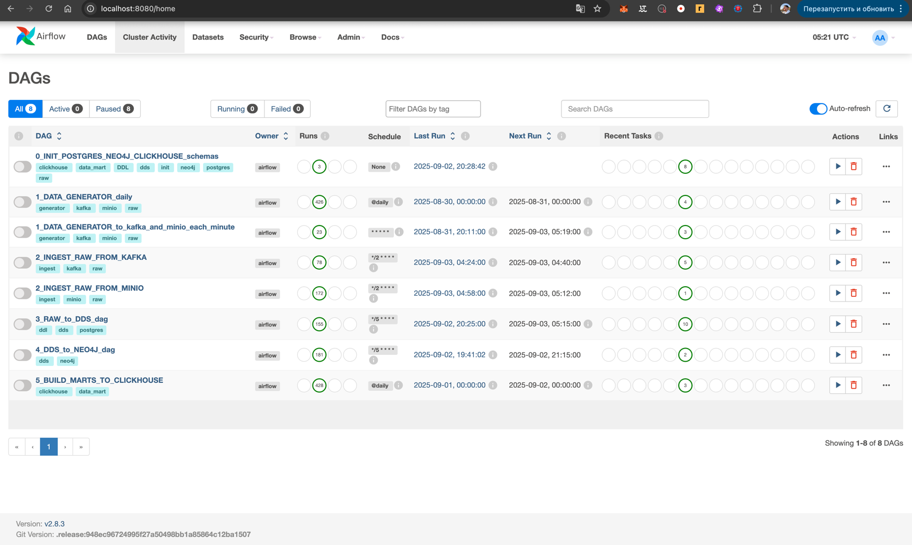
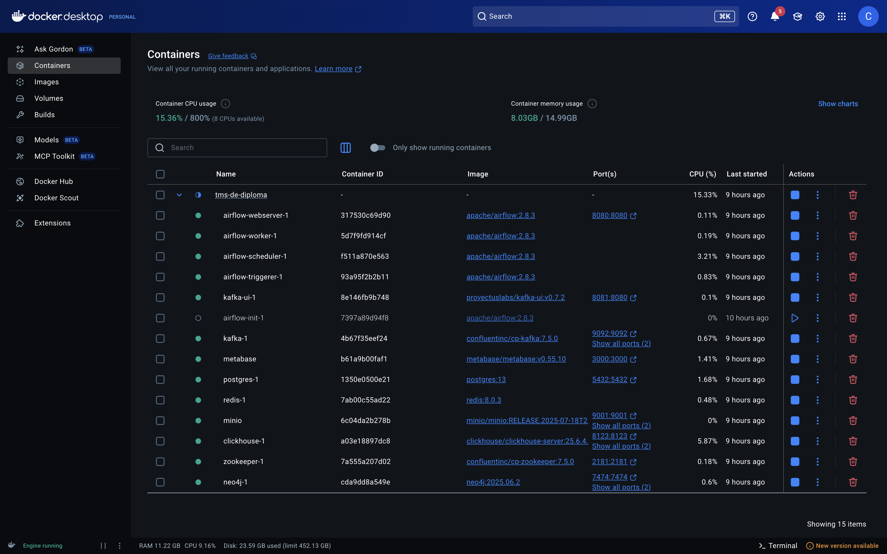
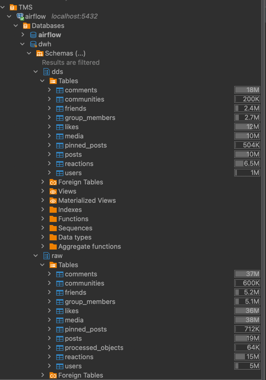
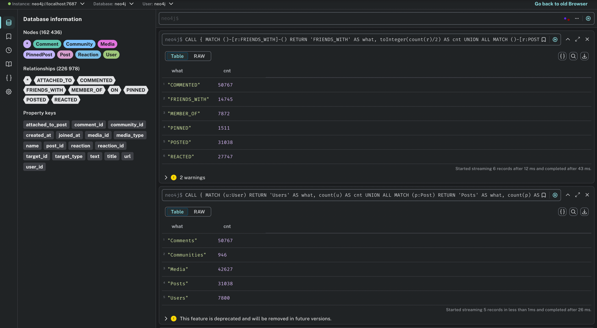
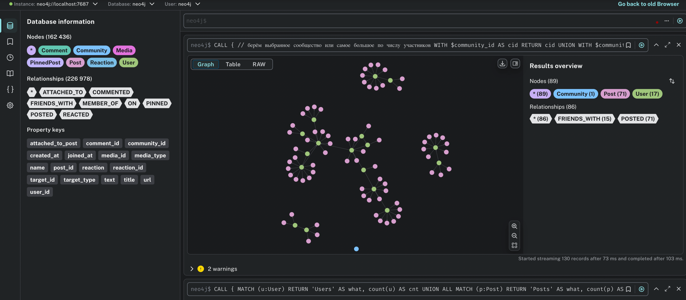
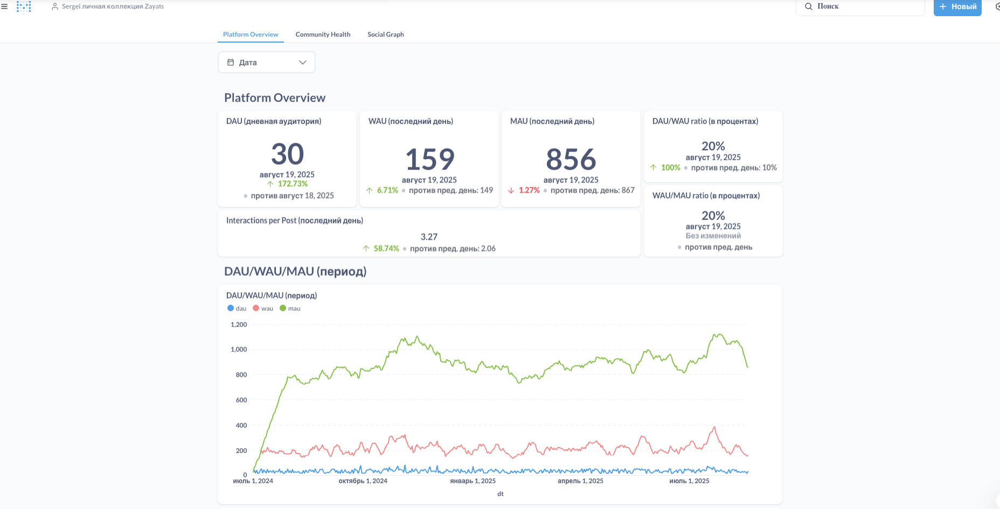
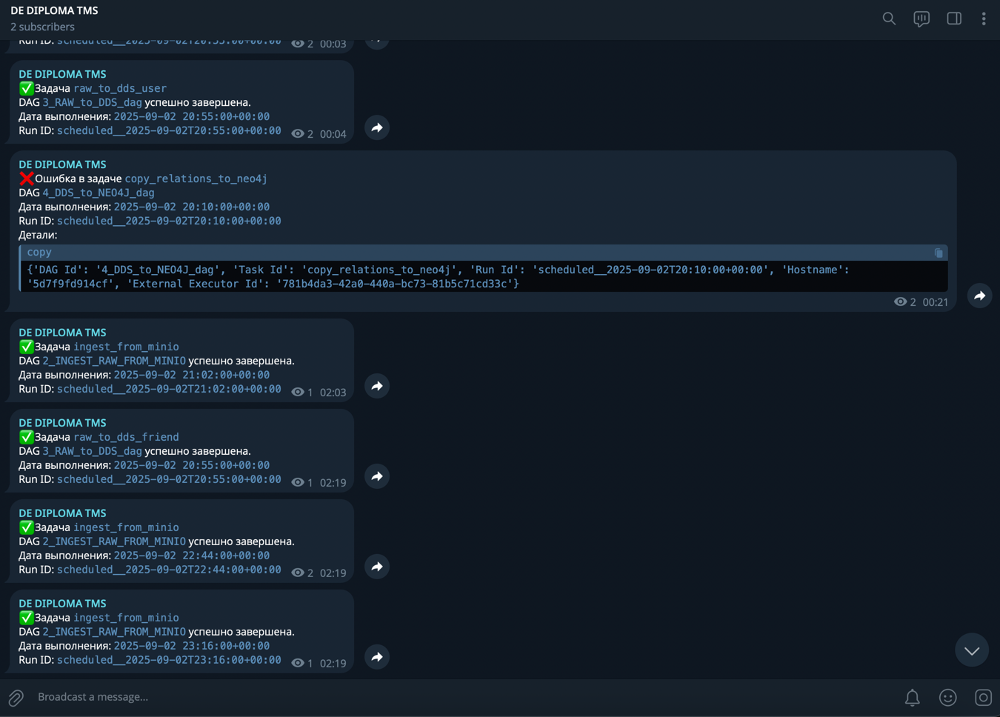

# TMS-DE-Diploma — Социальная аналитика (DWH/ETL)

Автор проекта: Sergei Zayats : [Github Gellershtein](https://github.com/Gellershtein)

<p align="left">
  <!-- стэк -->
  <a href="https://www.python.org/">
    
  </a>
  <a href="https://airflow.apache.org/">
    
  </a>
  <a href="https://www.postgresql.org/">
    
  </a>
  <a href="https://clickhouse.com/">
    
  </a>
  <a href="https://kafka.apache.org/">
    
  </a>
  <a href="https://min.io/">
    
  </a>
  <a href="https://neo4j.com/">
    
  </a>
  <a href="https://www.metabase.com/">
    
  </a>
  <!-- общее -->
  <a href="#">
    
  </a>

# Социальная аналитика: DWH/ETL-пайплайн пользовательских событий  
  
Полнофункциональный конвейер: генерация событий → Kafka/MinIO → Airflow (ingest → RAW → DDS → витрины) → PostgreSQL/Neo4j/ClickHouse → дашборды (Metabase).  
  
Проект моделирует продакшен-подход к построению корпоративного DWH, показывает работу со стримом (Kafka) и пачками (MinIO), графовую аналитику в Neo4j и быстрые витрины в ClickHouse.  

---

## 📄 Оглавление
- [Цели](#goals)
- [Архитектура](#architecture)
- [Структура репозитория](#repo-structure)
- [Быстрый старт](#quickstart)
- [Переменные окружения](#env)
- [DAG’и и порядок](#dags)
- [Валидация/индексы/окна](#validation)
- [Дашборды](#marts)
- [Бэкфилл](#backfill)
- [Масштабирование Kafka / ingest](#scale)
- [Логи, алерты, пулы](#ops)
- [Безопасность](#security)
- [FAQ / Известные проблемы](#faq)
- [Лицензия](#license)

---

<a id="goals"></a>
## 🎯 Цели
- Собрать событийную ленту соц‑платформы (посты, комментарии, реакции, дружбы, комьюнити).
- Сформировать DWH в PostgreSQL (RAW/DDS), граф — в Neo4j, витрины — в ClickHouse.
- Посчитать ключевые метрики (DAU/WAU/MAU, вовлечённость, метрики сообществ, граф).
- Автоматизировать пайплайн в Airflow и показать дашборды (Metabase / Tableau).

---
<a id="architecture"></a>
## 🏗️ Архитектура
 ### 🧰 Технологии    
 * **Инфра:** Docker, Docker Compose    
* **Транспорт/Хранилища:** Kafka, MinIO, PostgreSQL, Neo4j, ClickHouse    
* **Оркестрация:** Apache Airflow 2.8    
* **Генерация данных:** Python, Faker    
* **Валидация:** Pydantic (+ SQL-ограничения, индексы)    
* **BI:** Metabase (для витрин) 

### 🧱 Слои:    
    
* **RAW** — «как пришло» (аудит/повторная обработка).    
* **DDS** — нормализация, ключи, связи.   
* **DDS Neo4j** — ноды, связи, графы.    
* **Data Marts (CH)** — агрегаты по дням/сообществам/графу. 

### Архитектура проекта  
`Generator → Kafka/MinIO → Airflow ingest (RAW/Postgres) → DDS (Postgres) → Neo4j (граф) → ClickHouse (витрины) → Metabase`

### Архитектура DDS слоя 

   

Порты по умолчанию: Airflow 8080, MinIO 9000/9001, ClickHouse 8123/9000, Postgres 5432, Neo4j 7474/7687, Metabase 3000.


---
<a id="repo-structure"></a>
## 🗂️ Структура репозитория
```
.
├── README.md
├── docker-compose.yml
├── .env.example                 # шаблон переменных окружения (без секретов)
├── .gitignore 
├── LICENSE  
│  
├── dags/
│   ├── init_schemas_dag.py                     # 0_INIT_POSTGRES_NEO4J_CLICKHOUSE_schemas
│   ├── generate_events_dag.py                  # 1_DATA_GENERATOR_to_kafka_and_minio
│   ├── generate_events_dag_daily.py            # 1_DATA_GENERATOR_to_kafka_and_minio
│   ├── ingest_from_kafka_dag.py                # 2_INGEST_RAW_FROM_KAFKA
│   ├── ingest_raw_from_minio_dag.py            # 2_INGEST_RAW_FROM_MINIO
│   ├── raw_to_dds_dag.py                       # 3_RAW_to_DDS_dag
│   ├── dds_nodes_and_relations_to_neo4j_dag.py # 4_DDS_to_NEO4J_dag
│   └── build_marts_dag.py                      # 5_BUILD_MARTS_TO_CLICKHOUSE
├── etl/
│   ├── config.py                   # чтение переменных окружения/коннектов  
│   ├── ingestion.py                # Kafka/MinIO → RAW (Postgres)  
│   ├── create_database.py          # создание БД/схем (PG/CH)  
│   ├── init_schemas_postgres.py    # запуск SQL-скриптов (RAW/DDS/индексы/FK)  
│   ├── init_schemas_clickhouse.py  # запуск DDL ClickHouse  
│   ├── init_schemas_neo4j.py       # создание констрейнтов/индексов Neo4j  
│   ├── save_to_raw.py              # запись событий в RAW.* + mark/is processed
│   ├── save_to_dds.py              # запись событий в DDS.*  
│   │ 
│   ├── loaders/  
│   │   ├── raw_to_dds.py                                           # перенос сущностей RAW → DDS (порядок зависимостей)  
│   │   ├── dds_to_clickhouse_daily_platform_stats_metric.py        # рассчет метрик daily_platform_stats
│   │   ├── dds_to_clickhouse_community_stats_metric.py             # рассчет метрик community_stats
│   │   ├── neo4j_dds_to_clickhouse_social_graph_stats_metric.py    # рассчет метрик social_graph_stats
│   │   ├── dds_to_neo4j_nodes.py                                   # копирование узлов из DDS в Neo4j
│   │   └── dds_to_neo4j_relations.py                               # копирование связей из DDS в Neo4j  
│   │  
│   ├── loaders_utils/  
│   │   ├── load_sql.py               # util: загрузка SQL из sql/{ddl,dml,dql}  
│   │   └── load_cypher.py            # util: загрузка Cypher из cypher/{ddl,dml,dql}  
│   │  
│   └── utils/  
│       └── telegram_notifier.py  #Уведомление в телеграм о статусе задачи (успех или ошибка).
│  
├── generator/                    # генератор исторических/потоковых данных  
│   ├── generate_events.py        # фасады: generate_to_kafka / generate_to_minio / generate_all_data_and_return  
│   ├── generators.py             # функции generate_user/post/comment/... (Faker)  
│   ├── models.py                 # Pydantic-модели событий  
│   ├── writer.py                 # write_to_kafka / write_to_minio  
│   └── config.py                 # чтение переменных окружения/коннектов  
│
├── sql/                          # SQL (раскрываем ПАПКИ, файлы — в репо)  
│   ├── ddl/  
│   │   ├── init_schemas.sql      # создание схем raw, dds, data_mart  
│   │   ├── raw/                  # DDL таблиц RAW.*  
│   │   ├── dds/                  # DDL таблиц DDS.*   
│   │   │   └── indexes/          # индексы DDS (created_at, (created_at,user_id) и т.д.)  
│   │   └── data_mart/            # DDL ClickHouse (БД, таблицы витрин)  
│   │  
│   ├── dml/  
│   │   ├── raw/                  # upsert/insert в RAW (json → строки)  
│   │   ├── dds/                  # перенос RAW → DDS (merge/upsert, дедуп)  
│   │   └── data_mart/            # вставки/удаления/оптимизации в CH  
│   │  
│   └── dql/  
│       ├── dds/                  # селекты по DDS (материализация в Neo4j/витрины)  
│       └── data_mart/            # селекты расчётов метрик (DAU/WAU/MAU и др.)  
│  
├── cypher/  
│   ├── ddl/                      # констрейнты/индексы Neo4j (узлы User/Post/Community…)  
│   ├── dml/                      # создание узлов/связей (MERGE) при загрузке из DDS  
│   └── dql/                      # расчёт метрик графа (degree, summary, centrality)  
│  
├── dashboards/  
│   └── metabase/                 # примеры SQL, скриншоты, экспорт коллекций  
│  
├── docs/ 
│   ├── Demo/                     
│   ├── screenshots/                          # папко со скриншотами
│   ├── architecture.png                      # диаграмма архитектуры 
│   ├── project dds architecture.drawio       # диаграмма DDS архитектуры  
│   └── project dds architecture.png          # диаграмма DDS архитектуры  
```

---
<a id="quickstart"></a>
## 🚀Быстрый старт

```bash
# 0. Предусловия

- Docker с поддержкой Docker Compose установлен.
- Перед запуском убедитесь, что нужные порты свободны
- Клонировать репозиторий

   git clone https://github.com/IlonaKononovich/user-events-dwh-pipeline.git
   cd user-events-dwh-pipeline

# 1) подготовить переменные
	cp .env.example .env
# заполни значения (секреты руками; в git НЕ коммитить)

# 2) поднять окружение
	docker compose up -d --build
	docker compose ps

# 3) Airflow UI: http://localhost:8080  (логин/пароль из .env)

# 4) активировать и запустить последовательно:  
#    - 0_INIT_POSTGRES_NEO4J_CLICKHOUSE_schemas (единожды) 
#    - 1_DATA_GENERATOR_to_kafka_and_minio  (опц., можно оставить включенным)  
#    - 2_INGEST_RAW_FROM_KAFKA  (опц., можно оставить включенным)
#    - 2_INGEST_RAW_FROM_MINIO  (опц., можно оставить включенным)
#    - 3_RAW_to_DDS_dag (опц., можно оставить включенным)
#    - 4_DDS_to_NEO4J_dag (опц., можно оставить включенным)
#    - 5_BUILD_MARTS_TO_CLICKHOUSE (опц., можно оставить включенным) 
```

### 🔧 Подключения к сервисам ```(user/pass из `.env`)```
- **Airflow** — `http://localhost:8080`(UI)
- **Kafka** — `http://localhost:8081` (UI)
- **MinIO** — `http://localhost:9001` (UI)
- **Neo4j** — `http://localhost:7474` (UI)
- **Metabase** — `http://localhost:3000`(UI)
---
<a id="env"></a>
## 🧩 Переменные окружения
Смотри файл [`./.env.example`](./.env.example).

---
<a id="dags"></a>
##  ⛓️ DAG’и и порядок

 1. **`0_INIT_POSTGRES_NEO4J_CLICKHOUSE_schemas`**    
    
* Создаёт базы/схемы/таблицы RAW/DDS, индексы и  констрейнты Neo4j, БД/таблицы в ClickHouse.    
   * Важно: порядок — *RAW → DDS → индексы → Neo4j → ClickHouse*.    
    
2. **`1_DATA_GENERATOR_to_kafka_and_minio`**    
    
* Каждую минуту генерирует события Faker, отправляет в Kafka и складывает батчи в MinIO (`events/batch_YYYY-MM-DD_timestamp.json`).    
   * Поддерживает параметризацию периода (историчка).    
    
3. **`2_INGEST_RAW_FROM_KAFKA`**    
    
* Читает из Kafka, валидирует (pydantic/jsonschema), пишет в RAW (`raw.*`).    
   * При больших объёмах: увеличьте партиции горячих топиков и parallelism (см. «Масштабирование»).   
  
4. **`2_INGEST_RAW_FROM_MINIO`**  
* Читает батч-файлы JSON из **MinIO** (bucket из `.env`), парсит список событий, валидирует и пишет в `raw.*` (Postgres).  
      
* Поддерживает исторические данные (backfill), так как файлы лежат с датированными путями/именами.    
    
    * Идемпотентность: после успешной обработки объект удаляется из бакета (или помечается), чтобы не схватывать повторно.     
5. **`3_RAW_to_DDS_dag`**    
    
* Пошагово переносит сущности из RAW в DDS в **правильном порядке зависимостей** (user → friend → post → comment → reaction → community → group\_member → media → pinned\_post).    
   * Идемпотентность/дедуп: по естественным ключам + уникальным индексам.    
  
6. **`4_DDS_to_NEO4J_dag`**   
- Материализует граф в Neo4j из DDS: создаёт/обновляет узлы и связи.  
      
- Схема (пример):  
      
    - Узлы: `(:User {user_id})`, `(:Post {post_id})`, `(:Comment {comment_id})`, `(:Community {community_id})`, `(:Media {media_id})`.  
          
    - Связи (основные):  
          
        -   `(:User)-[:FRIENDS_WITH]->(:User)`  
         -   `(:User)-[:POSTED]->(:Post)`  
         -   `(:User)-[:COMMENTED]->(:Comment)`, `(:Comment)-[:ON_POST]->(:Post)`  
         -   `(:User)-[:REACTED {type}]->(:Post|:Comment)`  
         -   `(:User)-[:MEMBER_OF]->(:Community)`  
         -   `(:Community)-[:PINNED]->(:Post)`  
         -   `(:Post)-[:ATTACHED]->(:Media)`  
  - Использует метаданные `ENTITY_META` (SQL-выборки из DDS + Cypher MERGE).  
      
- Идемпотентность за счёт `MERGE` и уникальных констрейнтов (например, `CONSTRAINT FOR (u:User) REQUIRE u.user_id IS UNIQUE`).  
    
7. **`5_BUILD_MARTS_TO_CLICKHOUSE`**    
    
* Считает агрегаты в Postgres и загружает витрины в ClickHouse:    
    
     * `daily_platform_stats` (DAU/WAU/MAU, взаимодействия на пост и пр. — **окна \[d0,d1)**),    
     * `community_daily_stats` (по всем community),    
     * `social_graph_stats`, `social_user_centrality` (из Neo4j).    
---    
<a id="validation"></a>
 ## 🔍 Валидация, индексы, окна по датам    
 * **PG индексы**: `created_at`, `(created_at, user_id)` для posts/comments/reactions и тд.;    
* **Окна по датам**: все дневные метрики считают за `[d0, d1)` — без «вчерашних хвостов». Для WAU/MAU — `[w0, d1)`/`[m0, d1)`.    
* **Идемпотентность в CH**: удаляем партицию дня перед вставкой или используем `ReplacingMergeTree`/`DEDUPLICATE` (по ситуации).    
---    
<a id="marts"></a>
 ## 📊 Дашборды    
 ### MetaBase    
 1. Подключите ClickHouse (через ODBC/JDBC).    
2. Постройте дашборды:    
    
   * **Ежедневные агрегаты (data_mart.daily_platform_stats) «Платформа»**: DAU/WAU/MAU, DAU/WAU, вовлечённость на пост.    
   * **Статистика сообществ (data_mart.community_daily_stats)**: топ-10 (7 дней), прирост участников, воронка контента.    
   * **Соц. граф (data_mart.social_graph_stats, social_user_centrality)**: средняя степень, суммарно дружб, доля изолированных, центральность.    
* Поля `dt` фильтруйте параметром **Date**; воронка — суммы `posts`, `comments`, `reactions` за период.  

### ✅ Чек-лист демо/приёмки    
    
* ✅ Все сервисы в Docker поднялись, health-checks зелёные.

* ✅ В Airflow DAGи отработали по порядку без ошибок.    
* ✅ В Postgres заполнены RAW/DDS; в ClickHouse — витрины; в Neo4j — узлы/ребра.



* ✅ Дашборды (MetaBase): KPI платформы, сообщества, соц-граф.

<a id="backfill"></a>
## ⏪ Бэкфилл

### Backfill витрин (Airflow)
```bash
# посчитать витрины за период
airflow dags backfill 5_BUILD_MARTS_TO_CLICKHOUSE -s 2024-07-01 -e 2024-07-31
```
<a id="scale"></a>
## ⚙️ Масштабирование Kafka / ingest

- Можно увеличить количество **партиций** горячих топиков (posts/comments/reactions/likes):
```bash
docker exec -it kafka \
  kafka-topics --alter --topic posts --partitions 6 --bootstrap-server kafka:9092
```
- Запускать нескольких consumer’ов (одна consumer group) или повысить `max_active_runs` для DAG ingest.
- Бэтчинги и коммиты оффсетов в `ingestion.py` уже реализованы.


---
<a id="ops"></a>
## 📜🔔 Логи, алерты, пулы

- Логи — в Airflow UI; разные уровни, через `logging`.
- Telegram-алерты: `on_failure_callback`/`on_success_callback` в DAG’ах.
- Пулы (инициализируются в `airflow-init`):
  ```bash
  airflow pools set postgres_dwh 4 "Shared pool for DWH Postgres"
  airflow pools set neo4j 2 "Shared pool for Neo4j"
  ```

---
<a id="security"></a>
 ## 🔐 Безопасность    
 * Секреты **только** в `.env`, `.env.example` — без значений.   

<a id="faq"></a>
## 🐞 FAQ / Известные проблемы

**подвисания дагов из-за использования общего `postgres` для Airflow и DWH (raw, dds)**
    - можно разделить и поднять разные `postgres` 

**`connection to server at "postgres" ... Cannot assign requested address`**
- Проверьте лимиты соединений в Postgres и параметры Airflow (`worker_concurrency`, `parallelism`).  
- Используйте пулы и `max_active_runs=1` для тяжелых DAG’ов.  
- Убедитесь, что сервисы «здоровы» (`docker compose ps`, healthchecks).

**Metabase не видит ClickHouse**  
- Проверьте порты 8123/9000 и Пользователя/Пароль из `.env`.  
- В Metabase добавьте соединение как ClickHouse (через драйвер).
---
<a id="license"></a>
## 📄 Лицензия
MIT — см. файл [`LICENSE`](./LICENSE.txt).
